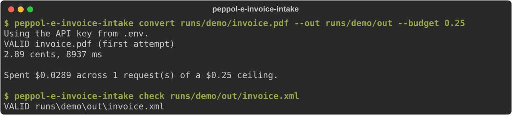
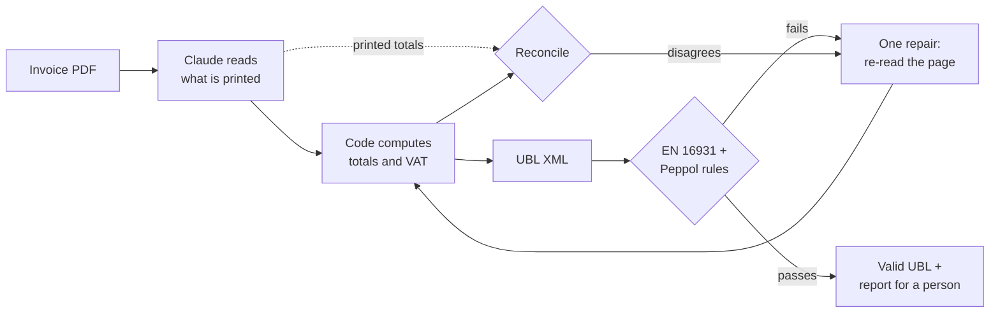

# peppol-e-invoice-intake

[](https://github.com/GillesVdSpiegel/peppol-e-invoice-intake/actions/workflows/ci.yml)

**Turns a supplier invoice PDF into a Peppol BIS Billing 3.0 e-invoice, validated
against the official EN 16931 and Peppol rule sets - and tells a person exactly what
it could not map, instead of guessing.**

Since 1 January 2026, Belgian B2B invoices must be structured e-invoices; a PDF no
longer satisfies the law. This is the intake step for the PDFs that still arrive.

A French reverse-charge invoice goes in:


and validated UBL comes out, for about three cents:



The part worth looking at in the output - the model read *"Autoliquidation"*, and
the pipeline turned it into the right VAT category with its legal reason, plus a
Peppol address that no paper invoice ever prints:

```xml
<cac:TaxCategory>
  <cbc:ID>AE</cbc:ID>                              <!-- reverse charge -->
  <cbc:Percent>0</cbc:Percent>
  <cbc:TaxExemptionReason>Autoliquidation - cocontractant, article 20 de l'AR n° 1</cbc:TaxExemptionReason>
  ...
<cbc:EndpointID schemeID="0208">0223344577</cbc:EndpointID>   <!-- derived from the VAT number -->
```

## Results

Measured on 50 held-out documents: synthetic invoices that nothing was tuned on, in
six visual layouts and three languages. Raw figures:
[docs/results/holdout-50-summary.json](docs/results/holdout-50-summary.json).

| Metric | Synthetic (held-out, n=50) | Real invoices |
|---|---|---|
| Per-field extraction accuracy | **99.9%** (3,427 of 3,429 fields) | pending |
| Fields invented | **0** | pending |
| Valid on first attempt | 96% (48 / 50) | pending |
| Valid after one repair attempt | 96% (48 / 50) | pending |
| Cost per invoice | **3.1 ¢** median, 3.7 ¢ mean | pending |
| Latency per invoice | **8.5 s** median | pending |

**Read this with the caveats, because they matter more than the headline.**
The two failures are one invoice, rendered twice, that is invalid *by design*: a
Swiss buyer whose Peppol address cannot be derived from anything printed, so the
pipeline flags it for a person rather than inventing one - and it did, both times.
The synthetic corpus is clean and digitally generated, and at 99.9% it has hit its
ceiling: it can no longer tell a good pipeline from a better one. Held out by
document, not by invoice - each base invoice also appears in the tuning sample in
a different layout. The real-invoice column is the number that counts.

## How it works



Three decisions shape everything:

- **The model reads; the code computes.** Claude returns only what is *printed*.
  Totals, VAT breakdown and rounding are computed deterministically, so the
  EN 16931 arithmetic rules hold by construction. That creates a trap - recompute
  everything and a misread quantity becomes a *valid invoice for the wrong amount*,
  invisible to validation - so the printed totals are extracted too and reconciled
  against the computed ones. It also means the validation pass rate says little:
  reconciliation is the check that catches a misreading, so it triggers the repair
  too.
  [Decision record](docs/decisions/0002-extract-then-compute.md).
- **One repair attempt, never a loop.** An unbounded loop converges on something
  that validates, which is not the same as something that is right. The repair
  re-reads the page at a higher effort, is shown described problems rather than
  raw validator output, is told not to invent values, and is discarded if it is no
  better than the first reading.
- **The validator is verified, not trusted.** Every number above rests on the rule
  engine being correct, so it runs two independent backends and a test asserts
  they agree on every fixture. [Decision record](docs/decisions/0001-dual-backend.md).

Cost is kept low deliberately: the first reading runs at low effort (reading an
invoice is transcription, not reasoning), only documents that fail a check pay for
a careful second look, and the roughly 4,000-token prompt and schema are cached.

## What broke, and what it taught me

Every one of these was found by testing against the real thing, not by reading code.

- **The API rejected the first real request outright** - "the compiled grammar is
  too large". Structured outputs compile the JSON schema into a grammar, and 38
  nullable fields meant 38 unions. Absence now travels as an empty string. Found by
  a one-invoice smoke test that cost nothing, before any batch run.
- **A truncated response crashed the run and went unbilled in my accounting.** The
  SDK parsed half-finished JSON mid-stream and raised before the stop reason
  arrived, so the spend cap undercounted exactly when something went wrong. Found by
  driving the real SDK through a mock HTTP transport, which the fake client used by
  the other tests could never have caught.
- **The model found a bug in my test data.** On the first evaluation it flagged that
  an invoice's printed unit prices did not reproduce its line totals. It was right:
  my templates printed `16,66` where the ground truth said `16.665`. Eight of the
  nine misses in that run were corpus defects, not reading errors, and the ninth
  was the designed-in Swiss case. A new audit now
  renders every invoice in every layout and fails if the ground truth claims
  anything the page does not show.
- **A layout silently dropped totals off the page - on Linux only.** A wider
  monospace font pushed amounts past the page edge; the HTML was right and the PDF
  rendered without error. Caught because CI runs on Windows and Ubuntu.
- **Six of my own twenty "known-good" invoices were invalid.** Among them, an
  exemption reason on zero-rated lines, which BR-Z-10 forbids. Caught because the
  corpus builder refuses to write any invoice the validator rejects.

## What this is not

- **It does not send anything over the Peppol network.** That needs a paid Access
  Point and a registered business identity; the output is network-ready UBL.
- **No hosted UI** - it is a CLI.
- **Invoices only** - no credit notes, self-billing or non-Belgian extensions.

## Running it

Requires Python 3.11+.

```bash
python -m venv .venv
.venv/Scripts/activate            # macOS / Linux: source .venv/bin/activate
pip install -e ".[dev]"
python scripts/fetch_artefacts.py
python -m playwright install chromium
pytest                            # 395 tests, no network, no API spend
```

```bash
peppol-e-invoice-intake convert invoice.pdf        # PDF -> validated UBL (calls the API)
peppol-e-invoice-intake check invoice.xml          # validate any UBL invoice
peppol-e-invoice-intake corpus build               # generate the 60-document test corpus
peppol-e-invoice-intake eval --sample 10           # measure against ground truth (calls the API)
```

`convert` and `eval` read `ANTHROPIC_API_KEY` from a gitignored `.env`
(`cp .env.example .env`). The key is loaded only into the CLI's own process, so
your shell - and any tool that changes its billing when that variable is set -
never sees it. Every paid run has a hard spend ceiling, checked before each request.

<details>
<summary><b>The validation harness</b></summary>

Three layers run in order, and each finding is tagged with the layer that produced
it, because Peppol rejects things core EN 16931 accepts:

1. **UBL 2.1 XSD** - structural; a schema-invalid document short-circuits the rest.
2. **EN 16931** - the CEN/TC 434 `BR-*` rules.
3. **Peppol BIS Billing 3.0** - the `PEPPOL-*` rules, including Belgian specifics
   such as `PEPPOL-COMMON-R043`, the mod-97 check on enterprise numbers.

| Backend | Runs | Role |
|---|---|---|
| `saxon` | Stylesheets compiled here from the Schematron source | Default |
| `official` | The stylesheets OpenPEPPOL compiled and ships | Oracle |

A test asserts both backends report identical findings for every fixture. The rule
sets are fetched and SHA-256 verified rather than committed, because not every
upstream licence permits redistribution - see [artefacts/NOTICE.md](artefacts/NOTICE.md).
Fourteen deliberately broken fixtures each pin the exact rule IDs they must trip.
</details>

<details>
<summary><b>The synthetic corpus</b></summary>

Rather than labelling PDFs by hand, the corpus starts from a model and emits both a
UBL document and a PDF from it, so ground truth is perfect by construction.

- **20 base invoices x 3 of 6 layouts = 60 documents**, in Dutch, French and
  English - each invoice written in one language throughout, because a Dutch
  invoice under French headings is not a document any supplier sends.
- **Chosen for what breaks extraction:** four VAT rates on one invoice, reverse
  charge, intra-community supply, export, discounts, prepayment, 42 lines over a
  page break, fractional hours, amounts from EUR 0.03 to EUR 584,180.50.
- **Six structurally different layouts** - one puts the amount column first, one
  states the total before the lines, one holds columns apart with whitespace alone -
  and each words the same business terms differently, so a pipeline cannot score
  by memorising strings.
- **Belgian conventions on the page** (`02/03/2026`, `1.520,50`), canonical values
  in the ground truth - normalising the gap is part of the job.
- **Identifiers are computed, not invented**: enterprise numbers pass mod-97, GLNs
  pass GS1, IBANs carry correct check digits.

Samples: [Dutch](docs/samples/classic-nl.pdf) ·
[French](docs/samples/letterhead-fr.pdf) · [English](docs/samples/ledger-en.pdf)
</details>

## Licence

MIT for the code and fixtures here. The downloaded validation artefacts keep their
own licences; see [artefacts/NOTICE.md](artefacts/NOTICE.md).
