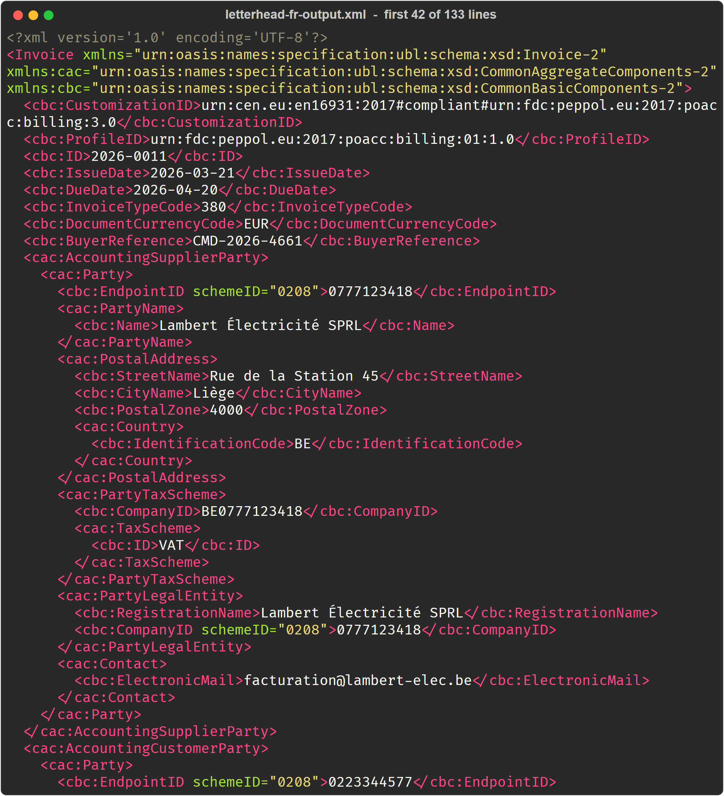
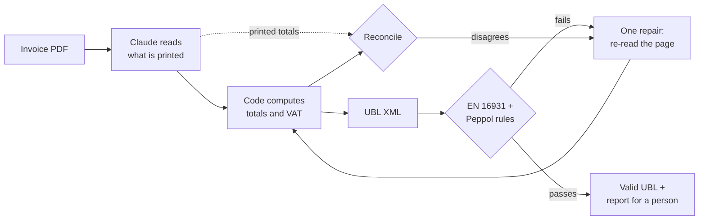

# peppol-e-invoice-intake

[](https://github.com/GillesVdSpiegel/peppol-e-invoice-intake/actions/workflows/ci.yml)

**English** · [Nederlands](README.nl.md)

**Turns a supplier's invoice PDF into a legally structured e-invoice - and checks
its own work against the official rulebook instead of guessing.**

## The problem this solves

Since 1 January 2026, Belgian businesses must send each other *structured*
e-invoices: a data file that the receiver's accounting software reads directly.
A PDF no longer satisfies the law - and a PDF is still what most suppliers email.

So someone has to turn those PDFs into data. Usually that someone is a person,
retyping about thirty fields per invoice and hoping they don't fat-finger a VAT
number.

This project does that step automatically. A PDF goes in. Out comes an invoice
file that has already been checked against the official European and Belgian
rules, plus a short report of anything the software was unsure about - so a person
reviews *that*, instead of the whole invoice.

One principle runs through the whole design: **the software is allowed to say "I
don't know", and it is not allowed to guess.** An invoice that is wrong but looks
right is worse than one that visibly failed, because nothing downstream catches it.

## See it work

On the left, what a supplier emails: a French invoice, with the line
*"Autoliquidation"* - reverse charge, where the buyer owes the VAT instead of the
seller. On the right, what the law now requires instead, produced from it.

| Before: the PDF that arrives | After: the e-invoice it becomes |
|---|---|
|  |  |
| [letterhead-fr.pdf](docs/samples/letterhead-fr.pdf) | [letterhead-fr-output.xml](docs/samples/letterhead-fr-output.xml) - both files are in this repo |

Neither picture is a mock-up. One command converted the left into the right, and a
second one independently checked the result - 8.9 seconds, 2.89 cents:


Inside the file it produced, two things are worth pointing at. The French word on
the page became the correct VAT code with its legal justification, and the
company's Peppol address - which no paper invoice ever prints - was derived from
its VAT number:

```xml
<cac:TaxCategory>
  <cbc:ID>AE</cbc:ID>                              <!-- reverse charge -->
  <cbc:Percent>0</cbc:Percent>
  <cbc:TaxExemptionReason>Autoliquidation - cocontractant, article 20 de l'AR n° 1</cbc:TaxExemptionReason>
  ...
<cbc:EndpointID schemeID="0208">0223344577</cbc:EndpointID>   <!-- derived from the VAT number -->
```

That is the whole job: read a page written for humans, and produce a file written
for machines, without inventing the difference. Both halves are committed, so the
claim can be checked rather than taken - running `check` on that XML is exactly
what the bottom half of the terminal image shows.

## What the numbers say

Measured on **50 invoices the pipeline had never seen**, in six visual layouts and
three languages. Every figure below comes from
[docs/results/holdout-50-summary.json](docs/results/holdout-50-summary.json),
written by the run itself.

| | |
|---|---|
| Fields read correctly | **99.9%** - 3,427 of 3,429 |
| Values invented (present in the output, absent from the page) | **0** |
| Totals matched what the invoice printed | **50 of 50** |
| Passed the official validation | **48 of 50** |
| Cost per invoice | **3.1 ¢** typical (3.7 ¢ average) |
| Time per invoice | **8.5 seconds** typical |
| Automated tests, run on Windows and Linux | 395 |
| Total spend on AI calls to build *and* measure the project | about $3 |

**The caveats matter more than the headline, so here they are, not in a footnote.**

- **The two failures are one invoice, and they are deliberate.** It has a Swiss
  buyer whose electronic address cannot be derived from anything printed on the
  page. The pipeline flagged it for a human rather than inventing one - which is
  exactly the behaviour I wanted - and it did so both times it saw it.
- **These are generated test invoices, not real ones.** They are clean, digital,
  and never smudged, skewed or scanned. At 99.9% the test set has hit its ceiling:
  it can no longer tell a good pipeline from a better one.
- **It has not been measured on real supplier invoices.** The tooling to do that
  fairly is in the repo (`real init` / `real eval`, with hand-typed labels so the
  model is never scored against its own answers), but the measurement was not run.
  Treat the number above as "works on clean inputs", not "works in your post room".
- **Held out by document, not by invoice.** Each of the 50 is a layout the
  pipeline had not seen, but some of the underlying invoices also appear elsewhere
  in a different layout.

I would rather publish a smaller honest number than a larger one that quietly
assumes its own test data.

## How it works



1. **An AI model reads the page** and returns only what is actually printed on it.
2. **Ordinary code does the arithmetic** - totals, VAT breakdown, rounding - so the
   sums are right by construction rather than by luck.
3. **The result is checked twice:** once against the official rulebook, and once
   against the totals printed on the original, which is how a misread quantity gets
   caught.
4. **If either check complains, the page is re-read once** - never in a loop - and
   the second reading is kept only if it is genuinely better.

### Three decisions I would defend in an interview

- **The model reads; the code computes.** European invoicing rules demand exact
  arithmetic, and asking a language model to do rounding-sensitive sums is asking
  it to fail slowly and expensively. But recomputing everything creates a trap: a
  misread quantity then produces a *valid invoice for the wrong amount*, which
  validation will happily wave through. So the printed totals are extracted as
  well and reconciled against the computed ones. That is the check that actually
  catches misreadings - and it means the validation pass rate, the number most
  demos would lead with, says the least.
  [Decision record](docs/decisions/0002-extract-then-compute.md).
- **One repair attempt, never a loop.** An unbounded retry loop converges on
  something that *validates*, which is not the same as something that is *right* -
  the cheapest way to satisfy a rule is usually to drop the field. So: one retry,
  shown a description of the problem rather than raw validator output, told
  explicitly not to invent values, and discarded if it is no better than the first
  reading.
- **The validator is verified, not trusted.** Every number on this page rests on
  the rule engine being correct, so the project runs two independent
  implementations of the rules and a test asserts they agree on every fixture.
  [Decision record](docs/decisions/0001-dual-backend.md).

Cost is kept low deliberately: the first reading runs at low reasoning effort
(reading an invoice is transcription, not thinking), only documents that fail a
check pay for a careful second look, and the fixed part of the prompt is cached.

## What broke, and what it taught me

Every one of these was found by testing against the real thing, not by reading code.

- **The API rejected my very first real request.** "The compiled grammar is too
  large" - 38 optional fields had become 38 branches in the output grammar. Absence
  now travels as an empty string instead. Found by a one-invoice smoke test that
  cost a few cents, before any batch run.
- **A truncated response crashed a run *and* under-reported what it had cost me.**
  The SDK parsed half-finished output and raised before the billing information
  arrived, so my spend cap undercounted at exactly the moment something went wrong.
  Found by driving the real SDK through a fake network layer - the simple test
  double used elsewhere could never have caught it.
- **The model found a bug in my test data.** On the first evaluation it reported
  that an invoice's printed unit prices did not reproduce its own line totals. It
  was right: my invoice templates printed `16,66` where the truth was `16.665`.
  Eight of the nine "mistakes" in that run were defects in my test set, not
  reading errors. There is now an audit that renders every invoice in every layout
  and fails the build if the expected answer claims anything the page does not
  actually show.
- **A layout silently dropped totals off the page - on Linux only.** A wider font
  pushed the amounts past the page edge; the HTML was fine and the PDF rendered
  without any error. Caught only because the tests run on Windows *and* Linux.
- **Six of my own twenty "known-good" invoices were invalid.** Among them, a
  legally required-sounding exemption note on zero-rated lines that the rules
  actually forbid. Caught because the test-data builder refuses to write any
  invoice the validator rejects.

## What this is not

- **It does not send anything over the Peppol network.** That needs a paid access
  point and a registered business identity. The output is a file that is ready to
  send.
- **There is no web interface** - it is a command-line tool.
- **Invoices only** - no credit notes, no self-billing, no non-Belgian extensions.
- **Not measured on real invoices**, as explained above.

## Running it

Requires Python 3.11 or newer.

```bash
python -m venv .venv
.venv/Scripts/activate            # macOS / Linux: source .venv/bin/activate
pip install -e ".[dev]"
python scripts/fetch_artefacts.py
python -m playwright install chromium
pytest                            # 395 tests, no network, no API spend
```

```bash
peppol-e-invoice-intake convert invoice.pdf        # PDF -> validated UBL (calls the API)
peppol-e-invoice-intake check invoice.xml          # validate any UBL invoice
peppol-e-invoice-intake corpus build               # generate the 60-document test set
peppol-e-invoice-intake eval --sample 10           # measure against known answers (calls the API)
```

Only `convert` and `eval` cost money. They read `ANTHROPIC_API_KEY` from a
git-ignored `.env` (`cp .env.example .env`), loaded into that command's own process
only - so your shell never holds the key, and every paid run has a hard spending
ceiling that is checked before each request.

<details>
<summary><b>The validation harness</b></summary>

Three layers run in order, and every finding is tagged with the layer that produced
it, because Peppol rejects things core EN 16931 accepts:

1. **UBL 2.1 XSD** - structural; a schema-invalid document short-circuits the rest.
2. **EN 16931** - the CEN/TC 434 `BR-*` business rules.
3. **Peppol BIS Billing 3.0** - the `PEPPOL-*` rules, including Belgian specifics
   such as `PEPPOL-COMMON-R043`, the mod-97 check on enterprise numbers.

| Backend | Runs | Role |
|---|---|---|
| `saxon` | Stylesheets compiled here from the Schematron source | Default |
| `official` | The stylesheets OpenPEPPOL compiled and ships | Oracle |

A test asserts both backends report identical findings for every fixture. The rule
sets are fetched and SHA-256 verified rather than committed, because not every
upstream licence permits redistribution - see [artefacts/NOTICE.md](artefacts/NOTICE.md).
Fourteen deliberately broken fixtures each pin the exact rule IDs they must trip.
</details>

<details>
<summary><b>The synthetic test set</b></summary>

Rather than labelling PDFs by hand, the test set starts from a model of an invoice
and emits both the expected data file and a PDF from it, so the expected answer is
correct by construction.

- **20 base invoices x 3 of 6 layouts = 60 documents**, in Dutch, French and
  English - each invoice written in one language throughout, because a Dutch
  invoice under French headings is not a document any supplier sends.
- **Chosen for what breaks extraction:** four VAT rates on one invoice, reverse
  charge, intra-community supply, export, discounts, prepayment, 42 lines over a
  page break, fractional hours, amounts from EUR 0.03 to EUR 584,180.50.
- **Six structurally different layouts** - one puts the amount column first, one
  states the total before the lines, one holds columns apart with whitespace alone -
  and each words the same business terms differently, so a pipeline cannot score
  well by memorising strings.
- **Belgian conventions on the page** (`02/03/2026`, `1.520,50`), canonical values
  in the expected answer - normalising the gap between them is part of the job.
- **Identifiers are computed, not invented**: enterprise numbers pass mod-97, GLNs
  pass the GS1 check, IBANs carry correct check digits.

Samples: [Dutch](docs/samples/classic-nl.pdf) ·
[French](docs/samples/letterhead-fr.pdf) · [English](docs/samples/ledger-en.pdf) ·
[the UBL produced from the French one](docs/samples/letterhead-fr-output.xml)

The generated documents themselves are not committed - `corpus build` recreates all
60 of them byte for byte, offline. Nor are the outputs of an evaluation run: each
run writes its own directory holding every converted invoice, the raw reading
behind it, and a per-field comparison against the expected answer, but those
directories stay local, because they are reproducible and because real invoices
would otherwise end up in git by accident.
</details>

<details>
<summary><b>Why this project exists</b></summary>

It is a portfolio project: a self-contained piece of work built to show how I
approach a real problem - a legal deadline, a messy input, a domain with an
unforgiving rulebook - and, more to the point, how I measure whether the result is
any good. The measurement and its caveats took longer to build than the pipeline,
which is roughly the ratio I think this kind of work deserves.
</details>

## Licence

MIT for the code and fixtures here. The downloaded validation artefacts keep their
own licences; see [artefacts/NOTICE.md](artefacts/NOTICE.md).
