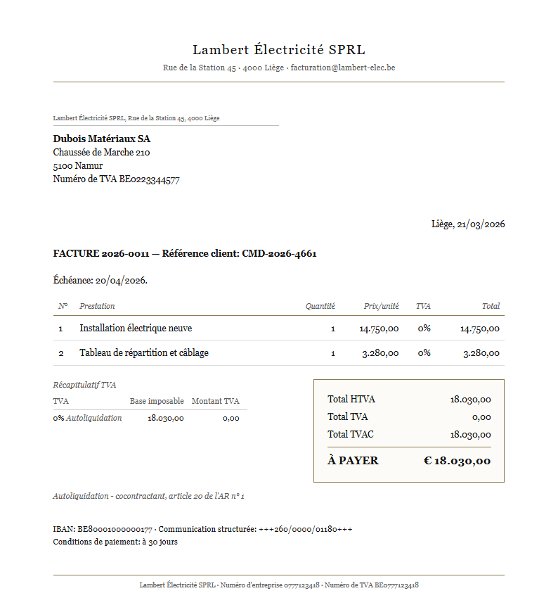
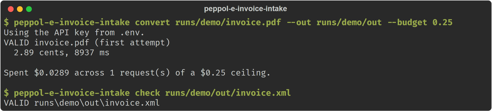
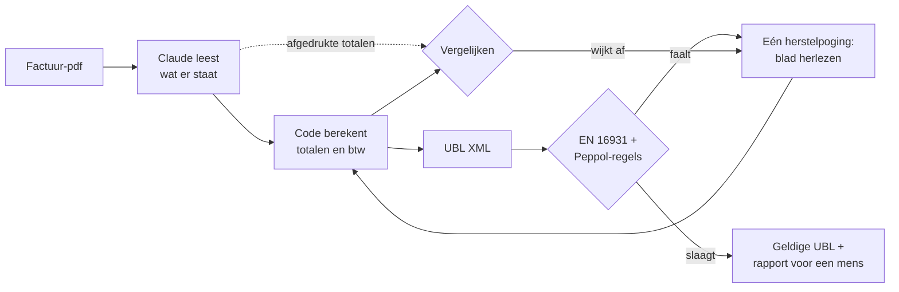

# peppol-e-invoice-intake

[](https://github.com/GillesVdSpiegel/peppol-e-invoice-intake/actions/workflows/ci.yml)

[English](README.md) · **Nederlands**

**Zet de pdf-factuur van een leverancier om in een wettelijk gestructureerde
e-factuur - en controleert zijn eigen werk aan het officiële regelboek in plaats
van te gokken.**

## Welk probleem dit oplost

Sinds 1 januari 2026 moeten Belgische bedrijven elkaar *gestructureerde*
e-facturen sturen: een databestand dat de boekhoudsoftware van de ontvanger
rechtstreeks kan inlezen. Een pdf volstaat wettelijk niet meer - en een pdf is nog
altijd wat de meeste leveranciers doormailen.

Iemand moet die pdf's dus omzetten naar data. Meestal is die iemand een mens, die
per factuur een dertigtal velden overtypt en hoopt dat er geen cijfer van een
btw-nummer sneuvelt.

Dit project doet die stap automatisch. Er gaat een pdf in. Er komt een
factuurbestand uit dat al getoetst is aan de officiële Europese en Belgische
regels, samen met een kort rapport van alles waar de software niet zeker van was -
zodat een mens *dat* nakijkt in plaats van de hele factuur.

Eén principe loopt door het hele ontwerp: **de software mag zeggen "ik weet het
niet", en mag niet gokken.** Een factuur die fout is maar er juist uitziet, is
erger dan een factuur die zichtbaar faalt, want verderop in de keten merkt niemand
het nog.

## Zo ziet het eruit

Er komt een Franstalige factuur binnen. Let op de vermelding
*"Autoliquidation"* - btw verlegd naar de medecontractant, waarbij de koper de btw
verschuldigd is in plaats van de verkoper:



Eén commando zet ze om, een tweede controleert het resultaat onafhankelijk. Dit is
een echte uitvoering, geen mock-up: 8,9 seconden en 2,89 cent.



In het bestand dat eruit komt, zijn twee dingen het vermelden waard. Het Franse
woord op het papier werd de juiste btw-code mét de wettelijke motivering, en het
Peppol-adres van het bedrijf - dat op geen enkele papieren factuur staat - werd
afgeleid uit het btw-nummer:

```xml
<cac:TaxCategory>
  <cbc:ID>AE</cbc:ID>                              <!-- btw verlegd -->
  <cbc:Percent>0</cbc:Percent>
  <cbc:TaxExemptionReason>Autoliquidation - cocontractant, article 20 de l'AR n° 1</cbc:TaxExemptionReason>
  ...
<cbc:EndpointID schemeID="0208">0223344577</cbc:EndpointID>   <!-- afgeleid uit het btw-nummer -->
```

Dat is de hele opdracht: een blad lezen dat voor mensen geschreven is, en er een
bestand van maken dat voor machines geschreven is, zonder het verschil zelf in te
vullen.

Beide helften van die uitvoering zitten in deze repository, zodat je de bewering
kan natrekken in plaats van ze te geloven: de factuur hierboven is
[docs/samples/letterhead-fr.pdf](docs/samples/letterhead-fr.pdf) en het bestand dat
eruit kwam is
[docs/samples/letterhead-fr-output.xml](docs/samples/letterhead-fr-output.xml).
`check` op dat tweede bestand loslaten is precies wat de onderste helft van de
terminalafbeelding toont.

## Wat de cijfers zeggen

Gemeten op **50 facturen die de pijplijn nog nooit gezien had**, in zes
verschillende lay-outs en drie talen. Elk cijfer hieronder komt uit
[docs/results/holdout-50-summary.json](docs/results/holdout-50-summary.json), door
de uitvoering zelf weggeschreven.

| | |
|---|---|
| Velden correct gelezen | **99,9%** - 3.427 van 3.429 |
| Verzonnen waarden (wel in de uitvoer, niet op het blad) | **0** |
| Totalen kwamen overeen met wat de factuur afdrukte | **50 van 50** |
| Door de officiële validatie geraakt | **48 van 50** |
| Kostprijs per factuur | **3,1 ¢** typisch (3,7 ¢ gemiddeld) |
| Tijd per factuur | **8,5 seconden** typisch |
| Geautomatiseerde tests, op Windows én Linux | 395 |
| Totale uitgaven aan AI-oproepen om dit te bouwen *en* te meten | ongeveer 3 dollar |

**De kanttekeningen wegen zwaarder dan het hoofdcijfer, dus staan ze hier en niet
in een voetnoot.**

- **De twee mislukkingen zijn één factuur, en ze zijn bewust zo gebouwd.** Ze heeft
  een Zwitserse klant van wie het elektronische adres uit niets op het blad af te
  leiden valt. De pijplijn heeft ze allebei de keren doorgegeven aan een mens in
  plaats van een adres te verzinnen - precies het gedrag dat ik wou.
- **Dit zijn gegenereerde testfacturen, geen echte.** Ze zijn proper, digitaal, en
  nooit gescand, scheef of vlekkerig. Op 99,9% zit die testset aan haar plafond:
  ze kan geen goede pijplijn meer onderscheiden van een betere.
- **Er is niet gemeten op echte leveranciersfacturen.** Het gereedschap om dat
  eerlijk te doen zit wél in de repo (`real init` / `real eval`, met labels die met
  de hand worden ingetypt zodat het model nooit tegen zijn eigen antwoorden wordt
  afgezet), maar die meting is niet uitgevoerd. Lees het cijfer hierboven dus als
  "werkt op propere invoer", niet als "werkt in uw postbak".
- **Apart gehouden per document, niet per factuur.** Elk van de 50 is een lay-out
  die de pijplijn niet gezien had, maar sommige onderliggende facturen komen elders
  in een andere lay-out wél voor.

Ik publiceer liever een kleiner cijfer dat klopt dan een groter cijfer dat stilletjes
zijn eigen testdata gelooft.

## Hoe het werkt



1. **Een AI-model leest het blad** en geeft alleen terug wat er effectief op staat.
2. **Gewone code doet het rekenwerk** - totalen, btw-opsplitsing, afronding - zodat
   de sommen kloppen bij constructie en niet bij toeval.
3. **Het resultaat wordt twee keer gecontroleerd:** één keer aan het officiële
   regelboek, en één keer aan de totalen die op het origineel gedrukt staan. Dat
   tweede is hoe een verkeerd gelezen aantal tegen de lamp loopt.
4. **Klaagt een van beide, dan wordt het blad één keer herlezen** - nooit in een
   lus - en de tweede lezing wordt alleen behouden als ze echt beter is.

### Drie keuzes die ik in een gesprek zou verdedigen

- **Het model leest; de code rekent.** De Europese factuurregels eisen exacte
  rekenkunde, en een taalmodel afrondingsgevoelige sommen laten maken is vragen om
  trage, dure fouten. Maar álles herberekenen creëert een valstrik: een verkeerd
  gelezen aantal levert dan een *geldige factuur voor het verkeerde bedrag* op, en
  daar stapt de validatie vrolijk overheen. Daarom worden ook de afgedrukte totalen
  uitgelezen en vergeleken met de berekende. Dát is de controle die verkeerde
  lezingen vangt - en het betekent meteen dat het validatieslaagpercentage, het
  cijfer waar de meeste demo's mee openen, het minste zegt.
  [Beslissingsnota](docs/decisions/0002-extract-then-compute.md).
- **Eén herstelpoging, nooit een lus.** Een onbegrensde lus convergeert naar iets
  dat *valideert*, en dat is niet hetzelfde als iets dat *juist* is - de goedkoopste
  manier om aan een regel te voldoen, is meestal het veld weglaten. Dus: één
  herkansing, die een beschrijving van het probleem te zien krijgt in plaats van
  ruwe validatie-uitvoer, die expliciet te horen krijgt niets te verzinnen, en die
  weggegooid wordt als ze niet beter is dan de eerste lezing.
- **De validator wordt geverifieerd, niet vertrouwd.** Elk cijfer op deze pagina
  steunt erop dat de regelmotor correct is, dus draait het project twee onafhankelijke
  implementaties van de regels, met een test die eist dat ze het over elke fixture
  eens zijn. [Beslissingsnota](docs/decisions/0001-dual-backend.md).

De kostprijs wordt bewust laag gehouden: de eerste lezing draait op lage
redeneerinspanning (een factuur lezen is overtypen, geen denkwerk), alleen documenten
die door een controle gebuisd zijn betalen voor een grondige tweede blik, en het
vaste deel van de prompt wordt gecacht.

## Wat er misging, en wat ik eruit geleerd heb

Elk van deze zaken kwam boven door tegen de echte wereld te testen, niet door code
te herlezen.

- **De API weigerde mijn allereerste echte verzoek.** "De gecompileerde grammatica
  is te groot" - 38 optionele velden waren 38 vertakkingen in de uitvoergrammatica
  geworden. Afwezigheid reist nu als een lege tekenreeks. Gevonden door een
  rooktest op één factuur, voor een paar cent, nog voor er een batch liep.
- **Een afgekapt antwoord deed een run crashen *én* rapporteerde te weinig kosten.**
  De SDK parste half afgewerkte uitvoer en gooide een fout voordat de
  facturatiegegevens binnen waren, waardoor mijn uitgavenplafond precies op het
  moment van de fout te laag telde. Gevonden door de echte SDK door een nagemaakte
  netwerklaag te draaien - de eenvoudige testdubbel die elders gebruikt wordt, kon
  dit nooit vangen.
- **Het model vond een fout in mijn testdata.** Bij de eerste evaluatie meldde het
  dat de afgedrukte eenheidsprijzen van een factuur haar eigen lijntotalen niet
  reproduceerden. Het had gelijk: mijn sjablonen drukten `16,66` af waar de waarheid
  `16.665` was. Acht van de negen "fouten" in die run waren gebreken in mijn testset,
  geen leesfouten. Er is nu een audit die elke factuur in elke lay-out rendert en de
  build laat falen als het verwachte antwoord iets beweert dat het blad niet toont.
- **Een lay-out liet totalen stilletjes van het blad vallen - alleen op Linux.** Een
  breder lettertype duwde de bedragen voorbij de bladrand; de HTML klopte en de pdf
  werd zonder één foutmelding gerenderd. Alleen gevangen omdat de tests op Windows
  *en* Linux draaien.
- **Zes van mijn eigen twintig "gekende goede" facturen waren ongeldig.** Onder meer
  een vrijstellingsvermelding op nultarieflijnen die wettelijk verplicht klinkt maar
  door de regels net verboden wordt. Gevangen omdat de bouwer van de testdata weigert
  een factuur weg te schrijven die de validator afkeurt.

## Wat dit niet is

- **Het verstuurt niets over het Peppol-netwerk.** Daar is een betalend access point
  en een geregistreerde bedrijfsidentiteit voor nodig. De uitvoer is een bestand dat
  klaar is om verstuurd te worden.
- **Er is geen webinterface** - het is een commandoregelprogramma.
- **Alleen facturen** - geen creditnota's, geen self-billing, geen niet-Belgische
  uitbreidingen.
- **Niet gemeten op echte facturen**, zoals hierboven uitgelegd.

## Zelf uitvoeren

Vereist Python 3.11 of nieuwer.

```bash
python -m venv .venv
.venv/Scripts/activate            # macOS / Linux: source .venv/bin/activate
pip install -e ".[dev]"
python scripts/fetch_artefacts.py
python -m playwright install chromium
pytest                            # 395 tests, geen netwerk, geen API-kosten
```

```bash
peppol-e-invoice-intake convert invoice.pdf        # pdf -> gevalideerde UBL (kost API-credits)
peppol-e-invoice-intake check invoice.xml          # valideer eender welke UBL-factuur
peppol-e-invoice-intake corpus build               # genereer de testset van 60 documenten
peppol-e-invoice-intake eval --sample 10           # meet tegen gekende antwoorden (kost API-credits)
```

Alleen `convert` en `eval` kosten geld. Ze lezen `ANTHROPIC_API_KEY` uit een
`.env` die git negeert (`cp .env.example .env`), enkel geladen in het proces van dat
ene commando - zo komt de sleutel nooit in je shell terecht, en elke betalende run
heeft een hard uitgavenplafond dat voor elk verzoek gecontroleerd wordt.

<details>
<summary><b>Het validatieharnas</b></summary>

Drie lagen draaien na elkaar, en elke bevinding krijgt het label van de laag die ze
voortbracht, want Peppol weigert dingen die de EN 16931-kern wél aanvaardt:

1. **UBL 2.1 XSD** - structureel; een document dat hier faalt, stopt de rest.
2. **EN 16931** - de `BR-*`-bedrijfsregels van CEN/TC 434.
3. **Peppol BIS Billing 3.0** - de `PEPPOL-*`-regels, inclusief Belgische specifieke
   zoals `PEPPOL-COMMON-R043`, de mod-97-controle op ondernemingsnummers.

| Backend | Draait | Rol |
|---|---|---|
| `saxon` | Stylesheets die hier uit de Schematron-bron gecompileerd zijn | Standaard |
| `official` | De stylesheets die OpenPEPPOL zelf compileert en meelevert | Referentie |

Een test eist dat beide backends voor elke fixture identieke bevindingen melden. De
regelsets worden opgehaald en via SHA-256 geverifieerd in plaats van meegeleverd,
omdat niet elke bovenstroomse licentie herdistributie toelaat - zie
[artefacts/NOTICE.md](artefacts/NOTICE.md). Veertien bewust kapotte fixtures pinnen
elk de exacte regel-ID's vast die ze moeten doen afgaan.
</details>

<details>
<summary><b>De synthetische testset</b></summary>

In plaats van pdf's met de hand te labelen, vertrekt de testset van een model van een
factuur en maakt daaruit zowel het verwachte databestand als een pdf, zodat het
verwachte antwoord correct is bij constructie.

- **20 basisfacturen x 3 van 6 lay-outs = 60 documenten**, in het Nederlands, Frans
  en Engels - elke factuur volledig in één taal, want een Nederlandse factuur onder
  Franse hoofdingen is geen document dat een leverancier ooit verstuurt.
- **Gekozen op wat extractie breekt:** vier btw-tarieven op één factuur, verlegging
  van heffing, intracommunautaire levering, uitvoer, kortingen, voorschot, 42 lijnen
  over een paginagrens, gebroken uren, bedragen van 0,03 EUR tot 584.180,50 EUR.
- **Zes structureel verschillende lay-outs** - één zet de bedragkolom vooraan, één
  vermeldt het totaal vóór de lijnen, één houdt kolommen enkel met witruimte uit
  elkaar - en elke lay-out verwoordt dezelfde begrippen anders, zodat een pijplijn
  niet goed kan scoren door tekenreeksen van buiten te leren.
- **Belgische conventies op het blad** (`02/03/2026`, `1.520,50`), canonieke waarden
  in het verwachte antwoord - die kloof dichtrijden hoort bij de opdracht.
- **Identificatoren worden berekend, niet verzonnen**: ondernemingsnummers doorstaan
  mod-97, GLN's de GS1-controle, IBAN's dragen correcte controlecijfers.

Voorbeelden: [Nederlands](docs/samples/classic-nl.pdf) ·
[Frans](docs/samples/letterhead-fr.pdf) · [Engels](docs/samples/ledger-en.pdf) ·
[de UBL die uit de Franse factuur kwam](docs/samples/letterhead-fr-output.xml)

De gegenereerde documenten zelf zitten niet in git - `corpus build` maakt alle 60
byte voor byte opnieuw aan, offline. De uitvoer van een evaluatie evenmin: elke run
schrijft zijn eigen map met elke omgezette factuur, de ruwe lezing erachter en een
veld-per-veldvergelijking met het verwachte antwoord, maar die mappen blijven
lokaal, omdat ze reproduceerbaar zijn en omdat er anders ooit een echte factuur per
ongeluk in git belandt.
</details>

<details>
<summary><b>Waarom dit project bestaat</b></summary>

Het is een portfolioproject: een afgerond stuk werk om te tonen hoe ik een echt
probleem aanpak - een wettelijke deadline, rommelige invoer, een domein met een
onverbiddelijk regelboek - en vooral hoe ik meet of het resultaat iets waard is. Die
meting en haar kanttekeningen hebben meer tijd gekost dan de pijplijn zelf, wat
ongeveer de verhouding is die dit soort werk volgens mij verdient.
</details>

## Licentie

MIT voor de code en de fixtures hier. De gedownloade validatieartefacten behouden hun
eigen licenties; zie [artefacts/NOTICE.md](artefacts/NOTICE.md).
